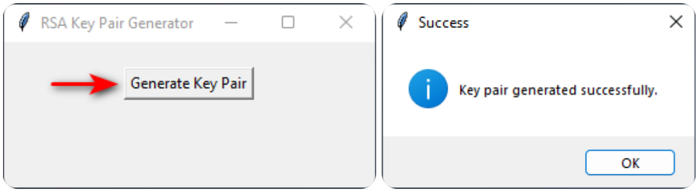
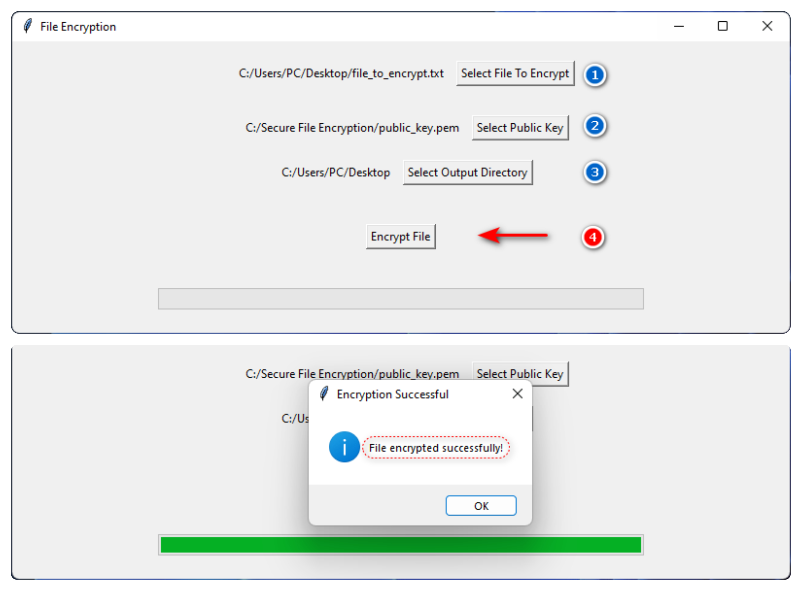

# Secure File Encryption Program
This is a simple Python program for securely encrypting files using symmetric and asymmetric encryption methods with integrity verification. 

## Features

- **Asymmetric Encryption**: Uses RSA for securely exchanging symmetric keys.
- **Symmetric Encryption**: Applies AES for secure file encryption with a symmetric key.
- **Progress Bar**: Provides a visual progress indicator for the encryption process.
- **Integrity Check**: Utilizes HMAC to ensure the integrity of encrypted data.

## Usage Scenario

This program is particularly useful in scenarios where secure file sharing is imperative. For instance, users can securely transmit sensitive files to recipients by encrypting them with the recipient's public key. Upon receiving the encrypted files, recipients can decrypt them using their private key, ensuring that only authorized parties can access the file contents. This approach significantly enhances security and privacy, as only individuals possessing the private key can decrypt and access the files.

## Getting Started

### Prerequisites

- Python 3.x
- pycryptodome library. You can install it via pip: `pip install pycryptodome`

### Usage

1. Clone the repository:
-      git clone https://github.com/adhamsaadi/Secure-File-Encryption.git
2. Navigate to the project directory:
-      cd Secure-File-Encryption
3. Run the program:
- First, you can generate a key pair using the command:
-       python3 keyGenerator.py
- Then you can encrypt your files using the generated public key:
-       python3 Encryptor.py
- Finally, decrypting files using the private key:
-       python3 Decryptor.py

## Screenshots

- Key Pair Generation

  

- File Encryption

  

## License

This project is licensed under the [MIT License](LICENSE).
